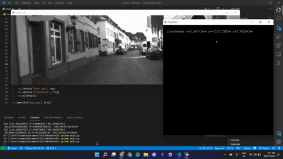

# MonoVO
 An implementation of Monocular Visual Odometry on the KITTI dataset using OpenCV in Python



### Requirements
* Python 2.7
* Numpy
* OpenCV
* PyKITTI

### Dataset
 [KITTI raw data set (cam0 grayscale)](http://www.cvlibs.net/datasets/kitti/raw_data.php)
 
### Usage
Modify the path in [main.py](main.py) to your image sequences and ground truth trajectories, then run
```
python test.py
```

### References
1. [Monocular Visual Odometry using OpenCV](http://avisingh599.github.io/vision/monocular-vo/) and its related project report [_Monocular Visual Odometry_](http://avisingh599.github.io/assets/ugp2-report.pdf) | Avi Singh
